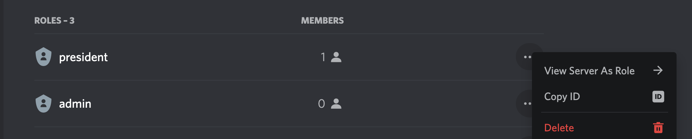

## Discord Role Adder Bot

A bot which adds a role to the specified members in a discord server (guild).

## Steps:

1. Create a `config.json` file with the following command:

```bash
cp config.sample.json config.json
```

2. Edit the `config.json` by inserting your `clientId`, `guildId`, `roleId` and `token`.
3. `clientId` is present in the specific application in https://discord.com/developers/applications.
4. Enable Developer Mode in `Settings > Advanced > Developer Mode`.
5. `roleId` can be copied by right clicking on a role in `Server Settings`.

6. `guildId` can be copied by right clicking on the server icon and then clicking on `Copy ID`.
7. `token` is generated on the discord developer portal for the bot.
8. Permissions are generated on developer portal, OAuth2 inside Settings. Mark `bot` and `applications.commands`.
9. Bot should have both Privileged Gateway Intents turned ON, namely, `Presence Intent` and `Server Members Intent`.

## Data:

1. Add a file named `discord_handles.txt` which consists of either discord IDs (ex: `123456789012345678`) or discord tags (ex: `x#y`) each on a new line.

## Considerations:

1. The program fetches all the members of a guild and caches it.
2. To add the bot to your server, `https://discordapp.com/api/oauth2/authorize?client_id=<CLIENT_ID>&permissions=8&scope=bot`.
3. Always run `node deploy_commands.js` first. This syncs the bot with you discord server, which is specified by `guildId`.
